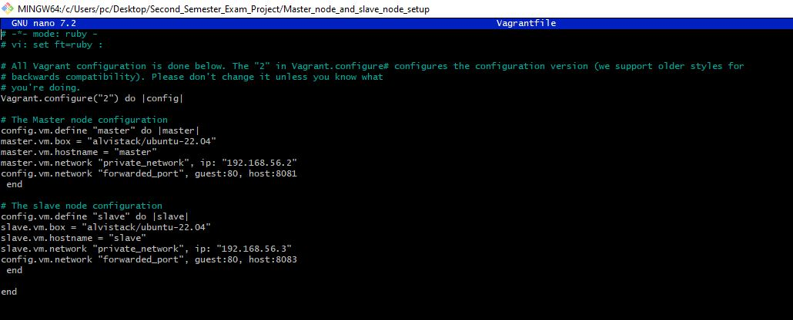
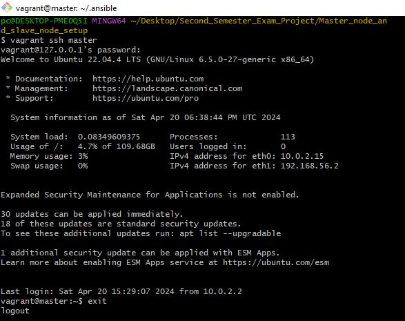
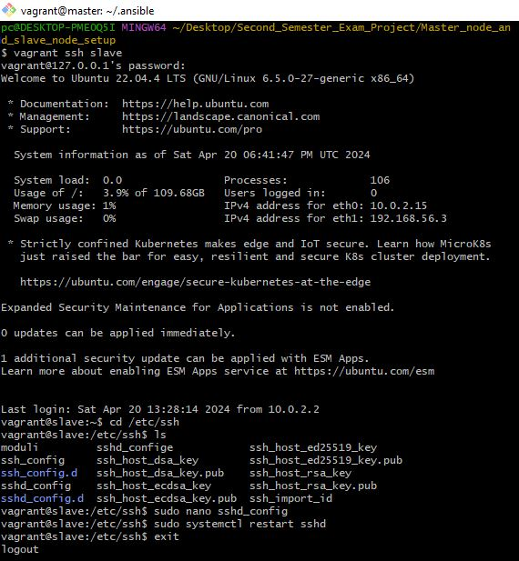
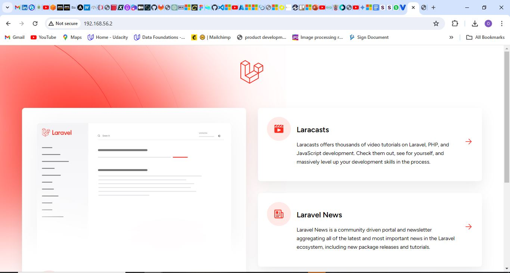
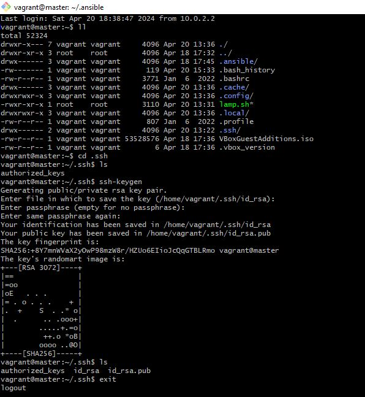
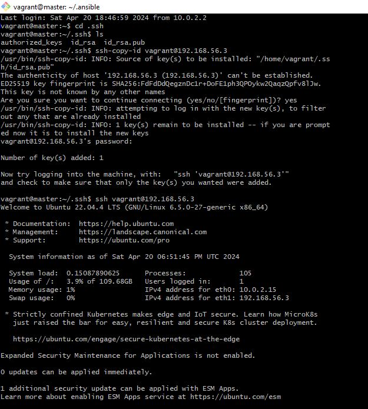
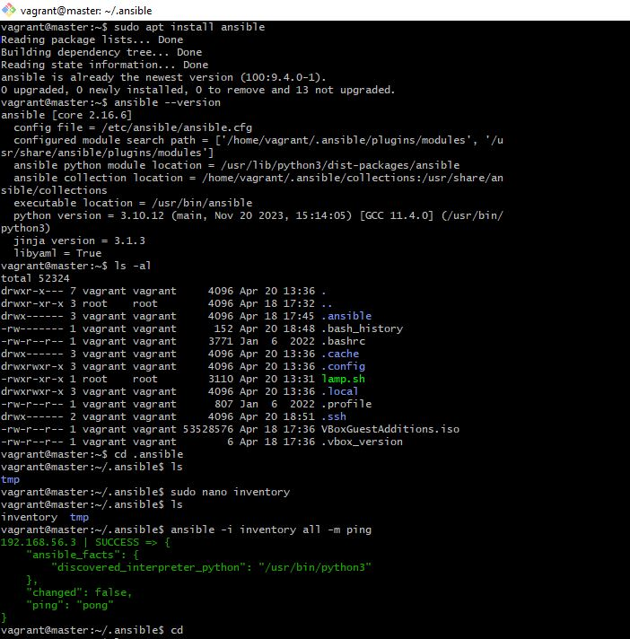
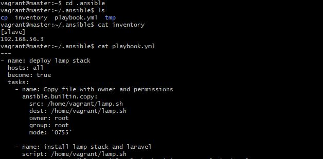
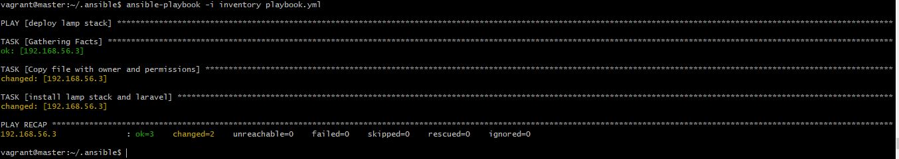
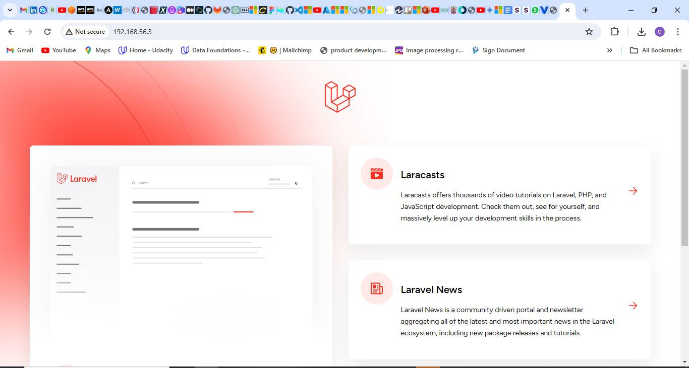

###Second Semester Exam Project Solution

1. `Automated setup of the master and slave nodes using Vagrant`

    
    
2. `Successful login to the master node`

    

3. `Successful login to the slave node`

    

4. `The lamp deployment script (lamp.sh) tested on the master node and the laravel application succesfully hosted on the master node`

    

5. `SSH key pair successfully generated in the master node`

    

6. `Public SSH key copied from the master node into the authorized key file of the slave node and able to remotely access the slave node from the master node via SSH`

    

7. `Ansible successfully installed on the master node, inventory file created and the slave node pinged successfully`

    

8. `Content of the master node's ansible directory, inventory file and playbook`

    

9. `Running the playbook from the master node`

    

10. `The lamp.sh script successfully copied to and ran on the slave node and the laravel application successfully hosted`

    
